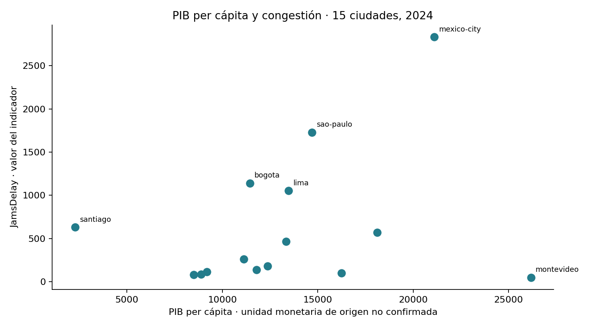
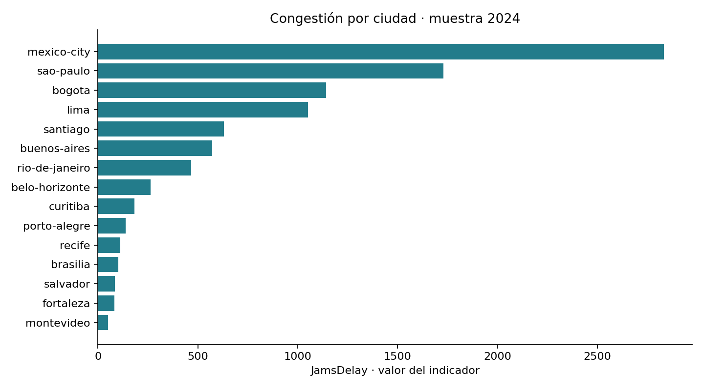

# Movilidad urbana y economía en Latinoamérica

**Mario Alberto Vivero | Python · pandas · análisis exploratorio**

Estudio de la relación entre congestión y PIB per cápita en **15 ciudades de 7 países durante 2024**. Proyecto académico revisado para presentar resultados reproducibles y recomendaciones acordes con la evidencia.

## Pregunta de análisis

¿Las ciudades con mayor PIB per cápita presentan mayor o menor congestión? La comparación permite identificar preguntas para un diagnóstico urbano posterior; no estima el efecto causal del tráfico sobre la economía.

## Hallazgos principales

| Resultado | Evidencia en el CSV |
|---|---|
| Mayor JamsDelay de la muestra | Ciudad de México: 2833.06; São Paulo: 1729.19; Bogotá: 1141.55 |
| Asociación lineal PIB–JamsDelay | Pearson: **0.283** |
| Sensibilidad al excluir Ciudad de México | Pearson PIB–JamsDelay: **−0.025**, 14 ciudades |
| Asociación población–JamsDelay | Pearson: **0.879** |
| Calidad estructural del CSV | 15 filas; 12 columnas; 0 nulos; 0 claves ciudad-país-año duplicadas |

La asociación entre PIB y congestión es débil y sensible a una observación. Estos resultados no justifican priorizar inversión en Bogotá ni concluir que el tráfico reduzca su productividad. La asociación con población indica que conviene investigar el tamaño urbano y la definición del indicador antes de comparar ciudades.

## Recomendaciones

- **Validar unidades y fuentes:** el PIB per cápita de Santiago figura como 2277 y requiere cotejo. No se corrigió sin evidencia.
- **Ampliar el diagnóstico de ciudades con congestión elevada:** investigar Ciudad de México, São Paulo y Bogotá junto con cobertura del transporte público, infraestructura y patrones de viaje. El ranking describe esta muestra, no una prioridad automática de inversión.
- **Incorporar tamaño urbano y cobertura temporal:** comprobar si se comparan observaciones equivalentes y si corresponde utilizar indicadores por viaje o habitante.
- **Evaluar costos y beneficios antes de invertir:** la correlación transversal de un año no demuestra impacto ni permite estimar el retorno de una intervención.

## Método y herramientas

El trabajo original utiliza Python, pandas, NumPy, Matplotlib y Seaborn para limpiar formatos, filtrar 2024, agregar observaciones de tráfico por ciudad y unirlas con indicadores económicos. La versión ejecutable de este repositorio utiliza pandas y Matplotlib sobre el CSV ya consolidado.

La revisión añade controles del archivo, conversión de PM2.5 a número, correlaciones descriptivas y sensibilidad. Sustituye la comparación de barras de magnitudes distintas por una dispersión con ejes separados. Estas ampliaciones se distinguen de la preparación histórica.

## Abrir y reproducir

1. Descarga o clona el repositorio.
2. En la carpeta del repositorio, instala las dependencias con `python -m pip install -r requirements.txt`.
3. Ejecuta `jupyter notebook` y abre [analisis_movilidad_economia.ipynb](notebooks/analisis_movilidad_economia.ipynb).
4. Ejecuta todas las celdas. El notebook lee el CSV incluido y regenera los gráficos en `images/`.

El notebook principal **se ejecutó completamente con el CSV aportado** al preparar esta versión y contiene sus salidas. Las dependencias indican versiones del entorno utilizado; no se ensayó una instalación nueva con pip.

| Archivo | Función |
|---|---|
| [Notebook principal](notebooks/analisis_movilidad_economia.ipynb) | Análisis reproducible con resultados |
| [Preparación histórica](notebooks/preparacion_historica.ipynb) | Código de integración original reorganizado; requiere fuentes no incluidas |
| [CSV de entrada](data/ladb_mobility_economy_2024_clean.csv) | Archivo aportado, conservado sin cambios |
| [Resumen ejecutivo](docs/resumen_ejecutivo.md) | Interpretación y acciones propuestas |
| [Datos y limitaciones](docs/datos_y_limitaciones.md) | Procedencia, variables y decisiones de revisión |

## Alcance

Muestra de 15 ciudades seleccionadas por disponibilidad conjunta de datos, con un registro consolidado por ciudad en 2024. Incluye Argentina, Brasil, Chile, Colombia, México, Perú y Uruguay; Brasil aporta 9 de las 15 ciudades. No representa a todas las ciudades de Latinoamérica.

Los nombres de archivos del ejercicio aluden a tráfico TomTom e indicadores OECD, pero no se aportaron enlaces ni metadatos para verificar su procedencia externa. No se afirma que sean datos oficiales verificados. No se conoce la licencia de la fuente y no se añade una licencia abierta para los datos.

`JamsDelay` se interpreta como el indicador original, **no como minutos perdidos por persona**. Faltan su definición completa, unidad y cobertura. El PIB per cápita no mide directamente productividad laboral; su moneda y comparabilidad requieren confirmación. Las correlaciones son descriptivas, sin pruebas de significancia ni inferencia causal.
